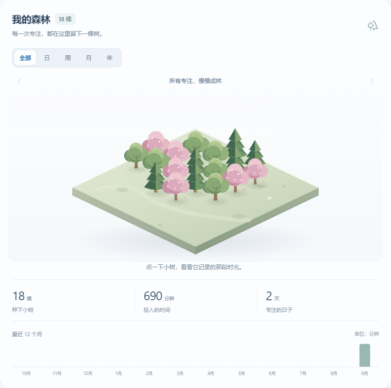

# 栖时 · Nest

面向个人的中文桌面日程工具，把**日历、专注森林与便签**放在一起。银白玻璃界面，数据保存在本机。



*演示图使用虚构测试记录，不包含个人数据。*

## 主要功能

- **日历**：月、周、日视图，按时间安排任务；支持拖动调整、完成标记、分类与自定义颜色。点击格内「＋」或双击空白时间格即可新建日程。
- **专注森林**：1–180 分钟倒计时，支持暂停、继续和重启恢复。每次完成专注种下一棵松树、橡树或樱花树，逐渐积成森林；点击树木查看记录，按日、周、月、年浏览统计。每片林地容纳 36 棵，更多记录可翻页查看。
- **奖励**：完成专注每分钟获得 1 枚叶币，可自定义奖励名称与兑换价格。
- **便签**：上方是逐条添加、勾选的待办，下方是自由随手记。支持自动保存、搜索和置顶；「桌面显示」可打开独立小窗口，拖动、缩放或置顶，内容与主窗口双向同步。
- **桌面常驻与备份**：托盘运行、窗口置顶、Windows 开机启动，以及数据导出和恢复。

## Windows 下载与更新

在本仓库的 **Releases** 下载 `Nest-Planner-1.0.3-Windows.exe`，放入固定文件夹，双击运行，无需安装。

关闭主窗口后，应用仍在系统托盘运行。点击托盘小树图标可重新打开；完全退出时，右键选择「退出栖时」。更新前先导出备份，再从托盘退出旧版本，随后打开新版，同一设备上的原有数据会继续保留。

若启用了开机启动，移动或重命名程序后，请重新关闭、开启一次开机启动设置。完全退出应用或关闭电脑期间不会弹出提醒；通知也受 Windows 勿扰模式影响。

## 数据与玻璃效果

这是本地单用户应用，没有账号或云同步。日程、专注和奖励保存在应用本地存储；便签与窗口状态位于应用用户数据目录，Windows 通常为 `%APPDATA%\Nest Planner`。

请通过「设置与数据」定期导出备份。备份包含个人记录，应保存在自己的文件夹中。浏览器开发预览与桌面版的数据相互独立，迁移时使用导出、导入。

独立便签在 **Windows 11 22H2 及以上**使用原生磨砂背景材质；较旧系统使用普通面板，透明效果会有所不同。支持范围见 [Electron 窗口材质文档](https://www.electronjs.org/docs/latest/api/browser-window#winsetbackgroundmaterialmaterial-windows)。

## 本地开发

项目使用 Node.js、npm；当前验证环境为 Node.js 25。桌面打包与原生测试在 Windows 上运行。

```powershell
npm ci
npm run dev
```

打开终端显示的本地地址进行浏览器预览。其他命令：

| 命令 | 用途 |
| --- | --- |
| `npm run build` | TypeScript 检查与生产构建 |
| `npm run desktop` | 构建并启动桌面应用 |
| `npm run package` | 打包 Windows 便携版，输出到 `release/` |
| `npm test` | 运行逻辑测试 |
| `npm run test:ui` | 运行浏览器流程测试 |
| `npm run test:desktop` | 运行桌面流程测试 |

浏览器测试需要先在另一个终端运行 `npm run dev`，当前配置使用 Microsoft Edge 无头模式。桌面测试前执行 `npm run prepare:desktop` 和 `npm run build`；测试使用隐藏窗口与独立数据目录。

## 技术栈与参考

- React、TypeScript、Vite：界面与应用逻辑。
- Electron：桌面窗口、托盘、通知与独立便签。
- SVG：小树与森林场景，无需网络图片。
- Node.js Test Runner、Playwright：逻辑与界面测试。

功能组织参考 [Evelyn-rgb-debug/TimeTracker](https://github.com/Evelyn-rgb-debug/TimeTracker)，将日历、时间记录与桌面工具整合到同一工作空间。栖时独立编写，没有复制该仓库的源码或图形资源。

## 更新记录

- **1.0.3 · 2026-09-12**：新增可累积的立体森林、历史时段统计与林地翻页；修复计时到期边界处理。
- **1.0.2 · 2026-09-11**：便签统一为待办与随手记双区，增加磨砂桌面窗口、自定义日程颜色和更清楚的添加操作。
- **1.0.1 · 2026-09-11**：修复滚动条及高缩放比例下的日历列对齐。
- **1.0.0 · 2026-09-11**：完成日历、专注奖励、本地便签与备份功能。
